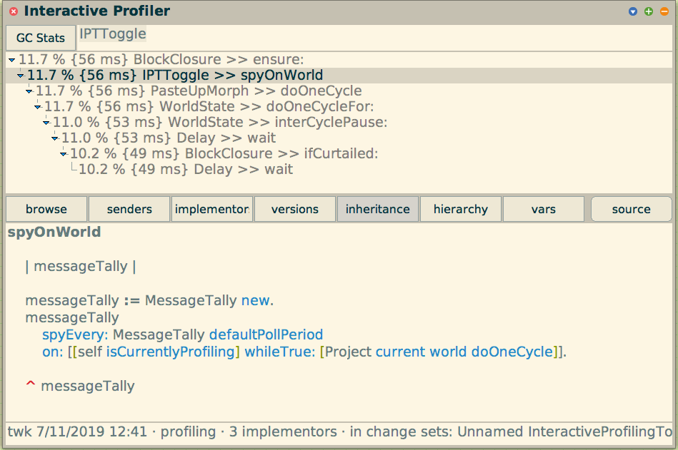
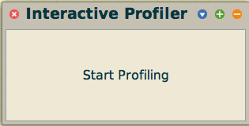
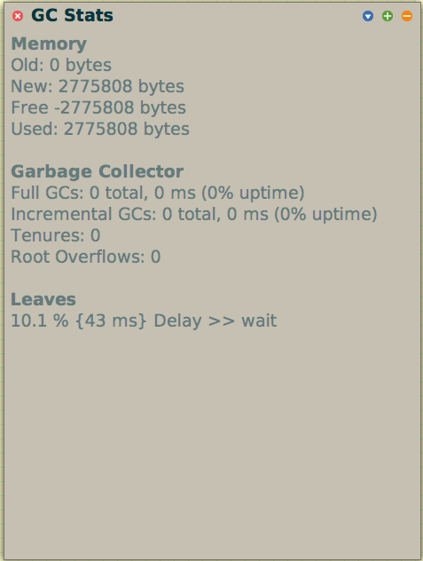

# InteractiveProfilingTool [](https://travis-ci.org/hpi-swa-teaching/InteractiveProfilingTool) 

This is a graphical Profiling-Tool for use in the Squeak-Smalltalk Environment.



## Features

- Profile the whole world via a start/stop-button
- See the calls made during the profiling as a graphical tree structure
- Filter the tree by method and class name
- Visual highlighting of expensive method calls
- Browse called methods directly from the profiler
- Edit code directly inside the profiler
- View GC stats for the profiled period

## Setup

Setup the project using Metacello. You may specify a branch other than `master`.

```smalltalk
Metacello new
    baseline: 'InteractiveProfilingTool';
    repository: 'github://hpi-swa-teaching/InteractiveProfilingTool:master/packages';
    load.
```
## Usage

### Profiling World
1. Open the Profiler via the World Menu under `Apps -> Interactive Profiler`
2. Toggle profiling
   
   

3. A report window as shown above opens  
4. Profit :money_with_wings:

## Remarks

1. A relevance threshold is employed to hide method calls with an insignificant runtime.  The value is hardcoded in such a way that method calls with less than 1% relative runtime are excluded from the result tree. If you want to change the threshhold, you can do so by changing the return value of `IPTMessageTallyWrapper >> callRelevancePercentage`.

2. Moreover, the spy-on functionality that allows profiling of individual methods is not yet fully implemented. If you know what you are doing, you can make a hacky solution like:
```smalltalk
tally := MessageTally new.
tally spyEvery: (MessageTally defaultPollPeriod) on: ["put your code here"].
IPTReport openReportFor: tally
```

3. Using the `GC Stats` you can view garbage collection stats for the profiled period:

   

Since there is no comprehensive, central documentation for the Squeak Garbage Collector, this may be a useful primer for you:

>The Squeak garbage collector follows the Mark-Sweep-Compact GC pattern. Memory is divided into two regions, the young and the old space. The young space contains short-lived objects, the old space contains long-lived objects (tenures).
There are two different garbage collection methods: Full GC and Incremental GC. An incremental GC collects garbage from the young space only, while a full GC runs in both regions.

If you are looking for more information on garbage collection in Squeak, [this wiki entry](https://wiki.squeak.org/squeak/1469)  on garbage collection in Squeak may be a good starting point.

## Further Work & Questions

If you want to work on this (or have to in a future SWT lesson :wink:) and have any questions, feel free to open Issues and/or @ us here on GitHub.
